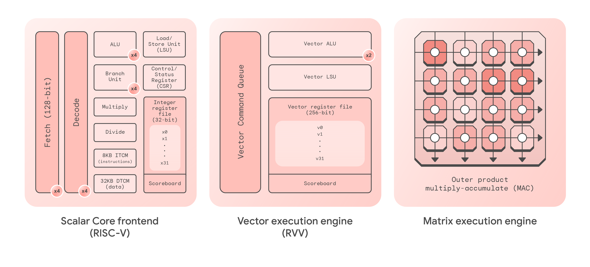

# Coral NPU

Coral NPU is a hardware accelerator for ML inferencing. Coral NPU is an Open Source IP designed by Google Research and is freely available for integration into ultra-low-power System-on-Chips (SoCs) targeting wearable devices such as hearables, augmented reality (AR) glasses and smart watches.

Coral NPU is a neural processing unit (NPU), also known as an AI accelerator or deep-learning processor. Coral NPU is based on the 32-bit RISC-V Instruction Set Architecture (ISA).

Coral NPU includes three distinct processor components that work together: matrix, vector (SIMD), and scalar.


[Coral NPU Architecture Datasheet](https://developers.google.com/coral/guides/hardware/datasheet)

## Coral NPU Features
Coral NPU offers the following top-level feature set:

* RV32IMF_Zve32x RISC-V instruction set (specifically `rv32imf_zve32x_zicsr_zifencei_zbb`)
* 32-bit address space for applications and operating system kernels
* Four-stage processor, in-order dispatch, out-of-order retire
* Four-way scalar, two-way vector dispatch
* 128-bit SIMD, 256-bit (future) pipeline
* 8 KB ITCM memory (tightly-coupled memory for instructions)
* 32 KB DTCM memory (tightly-coupled memory for data)
* Both memories are single-cycle-latency SRAM, more efficient than cache memory
* AXI4 bus interfaces, functioning as both manager and subordinate, to interact with external memory and allow external CPUs to configure Coral NPU

## System Requirements

* Bazel 6.2.1
* Python 3.9-3.12 (3.13 support is in progress)

## Quick Start

```bash
# Ensure that test suite passes
bazel run //tests/cocotb:core_mini_axi_sim_cocotb

# Build a binary
bazel build //examples:coralnpu_v2_hello_world_add_floats

# Build the Simulator (non-RVV for shorter build time):
bazel build //tests/verilator_sim:core_mini_axi_sim

# Run the binary on the simulator:
bazel-bin/tests/verilator_sim/core_mini_axi_sim --binary bazel-out/k8-fastbuild-ST-dd8dc713f32d/bin/examples/coralnpu_v2_hello_world_add_floats.elf
```


