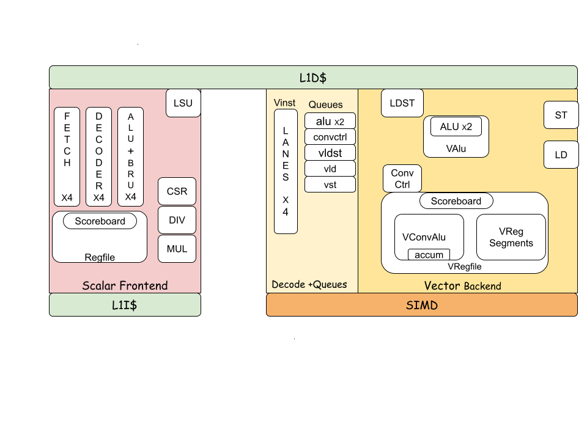

# Kelvin

Kelvin is a RISC-V32IM core with a custom instruction set.



More information on the design can be found in the
[overview](doc/overview.md).

## Getting Started

* If you are hardware engineer looking to integrate Kelvin into your design,
  check out our [integration guide](doc/integration_guide.md).
* If you are a software engineer looking to write code for Kelvin, start with
  [this tutorial](doc/tutorials/writing_kelvin_programs.md).

## Building

Kelvin uses [bazel](https://bazel.build/) as it's build system. The Verilated
simulator for Kelvin can be generated using:

```bash
bazel build //tests/verilator_sim:core_sim
```

The verilog source for the Kelvin core can be generated using:

```bash
bazel build //hdl/chisel/src/kelvin:core_cc_library_emit_verilog
```

Verilog source for the Matcha SoC can be generated using:

```bash
bazel clean --expunge  # To generate the ToT sha
bazel build //hdl/chisel:matcha_kelvin_verilog
```
