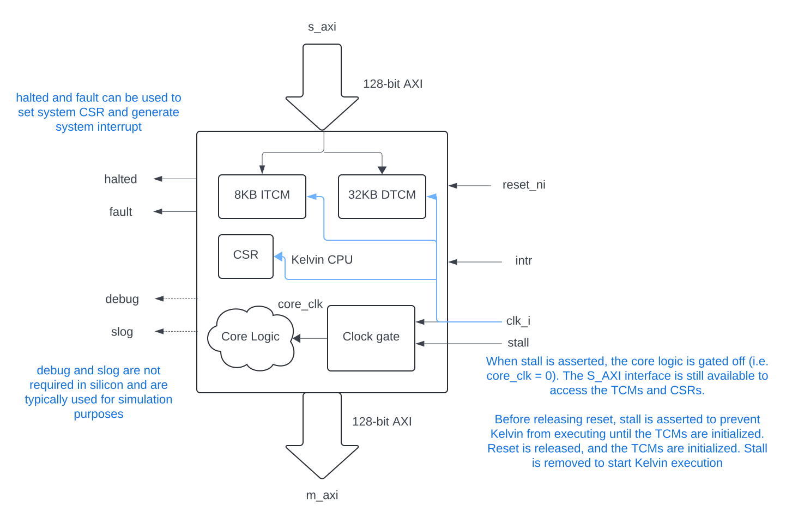

# Kelvin Integration Guide


This document describes integrating Kelvin as an AXI/TileLink peripheral in
a bigger system.

## AXI

We provide a scalar-only Kelvin configuration that can integrate with an AXI
based system. The SystemVerilog can be generated with:

``` bash
bazel build //hdl/chisel/src/kelvin:core_mini_axi_cc_library_emit_verilog
```

### Module interfaces



The interfaces to Kelvin are defined as follows:

|   Signal Bundle  |                   Description                             |
| ---------------- | --------------------------------------------------------- |
|       clk        | The clock of the AXI Bus/Kelvin core.                     |
|      reset       | The active-low reset signal for the AXI Bus/Kelvin core.  |
|      s_axi       | An AXI slave interface that can be used to write TCMs or touch Kelvin CSRs. |
|      m_axi       | An AXI master interface used by Kelvin to read/write to memories/CSRs. |
|       irqn       | Active-low interrupt to the Kelvin core. Can be triggered by peripherals or other host processor. |
|       wfi        | Active-high signal from the Kelvin core, indicating that the core is waiting for an interrupt. While this is active, Kelvin is clock-gated. |
|      debug       | Debug interface to monitor Kelvin instructions execution. This interface is typically only used for simulation. |
|      s_log       | Debug interface to handle SLOG instruction. This interface is typically only used for simulation. |
|      halted      | Output interface informing if the Core is running or not. Can be ignored. |
|      fault       | Output interface to determine if the Core hit a fault. These signals should be connected to a system control CPU interrupt-line or status register for notification when Kelvin faults or is halted. |


### Kelvin Memory Map

Memory accesses to Kelvin are defined as follows:

| Region |      Range        |  Size  | Alignment |                 Description                   |
| ------ | ----------------  | ------ | --------- | --------------------------------------------- |
|  ITCM  | 0x0000 -  0x1FFF  |   8kB  |  4 bytes  | ITCM storage for code executed by Kelvin.     |
|  DTCM  | 0x10000 - 0x17FFF |  32kB  |  1 byte   | DTCM storage for data used by Kelvin.         |
|  CSR   | 0x30000 - TBD     |   TBD  |  4 bytes  | CSR interface used to query/control Kelvin.   |

### Reset Considerations
Kelvin uses a synchronous reset strategy -- to ensure proper reset behavior, ensure that the clock runs for a cycle with reset active, before enabling either the internal clock gate (via CSR) or gating externally.
