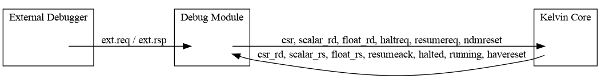

# Debug Module

## Overview

The debug module implements a subset of the RISC-V Debug Specification, providing external debug support for the CoralNPU core. It allows a debugger to halt, resume, and single-step the core, as well as read and write core registers and memory.

## Architecture

The debug module is a standalone module that connects to the core via a dedicated debug interface. It communicates with an external debugger through a simple request/response protocol.

The following diagram illustrates the high-level architecture of the debug module:

## Interfaces

The following table describes the internal hardware interfaces of the debug module:

| Name           | Direction | Type                  | Width | Description                               |
|----------------|-----------|-----------------------|-------|-------------------------------------------|
| **ext.req**    | Input     | Decoupled             |       | External debugger request.                |
| ↳ `valid`      |           | Bool                  | 1     | The request is valid.                     |
| ↳ `ready`      |           | Bool                  | 1     | The module is ready for a request.        |
| ↳ `bits`       |           | DebugModuleReqIO      |       | The request payload.                      |
|   ↳ `address`  |           | UInt                  | 32    | The address of the register to access.    |
|   ↳ `data`     |           | UInt                  | 32    | The data to write.                        |
|   ↳ `op`       |           | DmReqOp               | 2     | The operation to perform (NOP, READ, WRITE).|
| **ext.rsp**    | Output    | Decoupled             |       | External debugger response.               |
| ↳ `valid`      |           | Bool                  | 1     | The response is valid.                    |
| ↳ `ready`      |           | Bool                  | 1     | The debugger is ready for a response.     |
| ↳ `bits`       |           | DebugModuleRspIO      |       | The response payload.                     |
|   ↳ `data`     |           | UInt                  | 32    | The data read from the register.          |
|   ↳ `op`       |           | DmRspOp               | 2     | The result of the operation (SUCCESS, FAILED, BUSY).|
| **csr**        | Output    | Valid                 |       | CSR command.                              |
| ↳ `valid`      |           | Bool                  | 1     | The command is valid.                     |
| ↳ `bits`       |           | CsrCmd                |       | The command payload.                      |
| **csr_rd**     | Input     | Valid                 |       | CSR read data.                            |
| ↳ `valid`      |           | Bool                  | 1     | The read data is valid.                   |
| ↳ `bits`       |           | UInt                  | 32    | The read data.                            |
| **scalar_rd**  | Output    | Decoupled             |       | Scalar register file write command.       |
| ↳ `valid`      |           | Bool                  | 1     | The write command is valid.               |
| ↳ `ready`      |           | Bool                  | 1     | The register file is ready.               |
| ↳ `bits`       |           | RegfileWriteDataIO    |       | The write command payload.                |
| **scalar_rs**  |           | Bundle                |       | Scalar register file read interface.      |
| ↳ `idx`        | Output    | UInt                  | 5     | Scalar register file read address.        |
| ↳ `data`       | Input     | UInt                  | 32    | Scalar register file read data.           |
| **float_rd**   | Output    | Valid                 |       | Floating-point register file write command.|
| ↳ `valid`      |           | Bool                  | 1     | The write command is valid.               |
| ↳ `bits`       |           | FRegfileWrite         |       | The write command payload.                |
| **float_rs**   |           | Bundle                |       | Floating-point register file read interface.|
| ↳ `valid`      | Input     | Bool                  | 1     | Floating-point register file read valid.  |
| ↳ `addr`       | Input     | UInt                  | 5     | Floating-point register file read address.|
| ↳ `data`       | Input     | UInt                  | 32    | Floating-point register file read data.   |
| haltreq        | Output    | Bool                  | 1     | Request to halt the core.                 |
| resumereq      | Output    | Bool                  | 1     | Request to resume the core.               |
| resumeack      | Input     | Bool                  | 1     | Core has resumed.                         |
| ndmreset       | Output    | Bool                  | 1     | Reset the debug module.                   |
| halted         | Input     | Bool                  | 1     | Core is halted.                           |
| running        | Input     | Bool                  | 1     | Core is running.                          |
| havereset      | Input     | Bool                  | 1     | Core has been reset.                      |

## Command Protocol

An external debugger communicates with the debug module by reading and writing a set of memory-mapped Control and Status Registers (CSRs) over the AXI interface. These CSRs provide a communication channel to the debug module's internal registers.

### Write Operation

To write to an internal debug module register (e.g., writing `0x1` to `dmcontrol` at address `0x10`):

1.  **Poll for readiness:** Read the `status` CSR at `0x31014` and wait for bit 0 to be `1`.
2.  **Set address:** Write the target internal register address (`0x10`) to the `req_addr` CSR at `0x31000`.
3.  **Set data:** Write the data (`0x1`) to the `req_data` CSR at `0x31004`.
4.  **Initiate write:** Write the `WRITE` operation code (`2`) to the `req_op` CSR at `0x31008`.
5.  **Poll for response:** Read the `status` CSR at `0x31014` and wait for bit 1 to be `1`.
6.  **Check status:** Read the `rsp_op` CSR at `0x31010` to confirm the operation was successful.
7.  **Acknowledge response:** Write to the `status` CSR at `0x31014` to clear the response.

### Read Operation

To read from an internal debug module register (e.g., reading from `dmstatus` at address `0x11`):

1.  **Poll for readiness:** Read the `status` CSR at `0x31014` and wait for bit 0 to be `1`.
2.  **Set address:** Write the target internal register address (`0x11`) to the `req_addr` CSR at `0x31000`.
3.  **Initiate read:** Write the `READ` operation code (`1`) to the `req_op` CSR at `0x31008`.
4.  **Poll for response:** Read the `status` CSR at `0x31014` and wait for bit 1 to be `1`.
5.  **Check status:** Read the `rsp_op` CSR at `0x31010` to confirm the operation was successful.
6.  **Read data:** Read the result from the `rsp_data` CSR at `0x3100c`.
7.  **Acknowledge response:** Write to the `status` CSR at `0x31014` to clear the response.

## AXI CSR Interface

These registers are mapped into the CoralNPU CSR address space and are used to communicate with the debug module.

| Address    | Name       | Description                                                                                                |
|------------|------------|------------------------------------------------------------------------------------------------------------|
| 0x30800    | req_addr   | Write the target debug module register address here.                                                       |
| 0x30804    | req_data   | Write data for the debug module operation here.                                                            |
| 0x30808    | req_op     | Write the operation type (e.g., READ, WRITE) to this register to initiate a debug module command.          |
| 0x3080c    | rsp_data   | After a command completes, the data result is available here.                                              |
| 0x30810    | rsp_op     | After a command completes, the status result (e.g., SUCCESS, FAILED) is available here.                    |
| 0x30814    | status     | A read-only register to check the status of the debug module. Bit 0 indicates if the module is ready for a new request. Bit 1 indicates if a response is available. |

## Internal Debug Module Registers

The debug module implements a set of internal registers that are accessible to an external debugger via the AXI CSR interface. These registers are used to control and monitor the core.

| Address | Name         | Description                               |
|---------|--------------|-------------------------------------------|
| 0x04    | data0        | Data register for abstract commands.      |
| 0x10    | dmcontrol    | Debug module control register.            |
| 0x11    | dmstatus     | Debug module status register.             |
| 0x12    | hartinfo     | Hart information register.                |
| 0x16    | abstractcs   | Abstract command status register.         |
| 0x17    | command      | Abstract command register.                |

### dmcontrol (0x10)

The `dmcontrol` register is used to control the debug module and the core.

| Bits  | Name      | Description                                                                 |
|-------|-----------|-----------------------------------------------------------------------------|
| 31    | haltreq   | Request to halt the core.                                                   |
| 30    | resumereq | Request to resume the core.                                                 |
| 29:2  | reserved  | Reserved for future use.                                                    |
| 1     | ndmreset  | Reset the debug module.                                                     |
| 0     | dmactive  | Activate the debug module.                                                  |

### dmstatus (0x11)

The `dmstatus` register provides the status of the debug module and the core.

| Bits  | Name       | Description                                                                 |
|-------|------------|-----------------------------------------------------------------------------|
| 11    | allrunning | All harts are running.                                                      |
| 10    | anyrunning | Any hart is running.                                                        |
| 9     | allhalted  | All harts are halted.                                                       |
| 8     | anyhalted  | Any hart is halted.                                                         |
| 7:4   | reserved   | Reserved for future use.                                                    |
| 3:0   | version    | Debug module version.                                                       |

### abstractcs (0x16)

The `abstractcs` register provides the status of abstract commands.

| Bits  | Name     | Description                                                                 |
|-------|----------|-----------------------------------------------------------------------------|
| 12    | busy     | The abstract command is currently executing.                                |
| 11    | reserved | Reserved for future use.                                                    |
| 10:8  | cmderr   | Abstract command error code.                                                |
| 7:0   | reserved | Reserved for future use.                                                    |

### command (0x17)

The `command` register is used to issue abstract commands to the core.

| Bits    | Name      | Description                                                                 |
|---------|-----------|-----------------------------------------------------------------------------|
| 31:24   | cmdtype   | The type of abstract command.                                               |
| 23:0    | control   | Command-specific control information.                                       |

## Abstract Commands

Abstract commands are used to perform complex operations on the core, such as reading and writing registers.

To issue an abstract command, the debugger writes to the `command` register. The `cmdtype` field specifies the type of command, and the `control` field contains command-specific information.

### Access Register Command (cmdtype=0)

The Access Register command is used to read and write core registers.

The `control` field for the Access Register command is formatted as follows:

| Bits    | Name      | Description                                                                 |
|---------|-----------|-----------------------------------------------------------------------------|
| 16      | write     | 1 for a write, 0 for a read.                                                |
| 15:0    | regno     | The number of the register to access.                                       |

The register numbers are defined as follows:

*   `0x0000-0x0FFF`: CSRs
*   `0x1000-0x101F`: Scalar GPRs
*   `0x1020-0x103F`: Floating-point GPRs

## Command Examples

### Reading a GPR (a0)

1.  **Issue the read command:** Write to the `command` register (address `0x17`) with the following value:
    *   `cmdtype` (bits 31:24): `0x0` (Access Register)
    *   `write` (bit 16): `0` (read)
    *   `regno` (bits 15:0): `0x100A` (for `a0`)
2.  **Wait for completion:** Poll the `abstractcs` register (address `0x16`) until the `busy` bit (bit 12) is cleared.
3.  **Check for errors:** Read the `abstractcs` register again and check that the `cmderr` field (bits 10:8) is `0`.
4.  **Read the result:** If there are no errors, read the value of GPR `a0` from the `data0` register (address `0x04`).

### Writing a GPR (a0)

1.  **Write the value:** Write the desired value for GPR `a0` to the `data0` register (address `0x04`).
2.  **Issue the write command:** Write to the `command` register (address `0x17`) with the following value:
    *   `cmdtype` (bits 31:24): `0x0` (Access Register)
    *   `write` (bit 16): `1` (write)
    *   `regno` (bits 15:0): `0x100A` (for `a0`)
3.  **Wait for completion:** Poll the `abstractcs` register (address `0x16`) until the `busy` bit (bit 12) is cleared.
4.  **Check for errors:** Read the `abstractcs` register again and check that the `cmderr` field (bits 10:8) is `0`.
