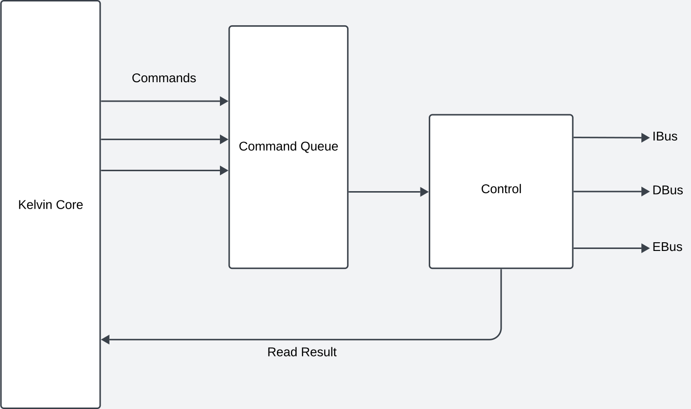

# Load Store Unit

The Load Store Unit handles memory operations issued by the core. Functionally,
it's purpose is to translate memory instructions into transactions on the
appropriate subsystem.

## Slots

The CoralNPU LSU uses a concept called _slots_ to handle memory transactions. A
slot is a data structure which manages the state of a single dispatched LSU
operation and determines what memory transaction should be performed. At its
core, there exists a table in each slot which tracks which part of the memory
operation has been completed.

For example, below is the slot table for a word-store into address 0xDEADBEEF:

| Index | Active |   Address  | Data |
| ----- | ------ | ---------- | ---- |
|   0   |    1   | 0xDEADBEEF | 0x01 |
|   1   |    1   | 0xDEADBEF0 | 0x23 |
|   2   |    1   | 0xDEADBEF1 | 0x45 |
|   3   |    1   | 0xDEADBEF2 | 0x67 |
|   4   |    0   | 0xDEADBEF3 | 0x00 |
...
|   n   |    0   | 0xDEADBEF3 | 0x00 |

Memory transactions over TCM or AXI busses will read/write data in the slot
table and flip the active bits to 0 as they are made.

The typical lifetime of a slot is as follows:

1) **Idle**: An idle slot will dequeue a LsuOperation from the command queue.
Scalar operations will move directly into **Transfer Memory** while vector
operations will go to the **Vector Update** state.
2) **Vector Update**: For vector operations masks, addresses (for indexed ops)
and data (for store ops) need to be received from the RvvCore. This stage is
bypassed for scalar operations.
3) **Transfer Memory**: While there are still active entries in the slot table,
the active entry with the lowest "index" will be selected for a memory
transaction. A scatter/gather unit will then select all other active entries
(although not necessarily contiguous) that will be bundled with the transaction.
The appropriate memory bus (ibus, dbus, ebus) will then be selected and a memory
transaction will be conducted. When there are no active entries, the slot moves
into the next state (**Writeback**).
4) **Writeback**: Once all memory transactions are completed, the result must
be written back to register files. Additionally, vector stores are
"acknowledged" back to the RvvCore. Scalar and floating point scores bypass this
stage. Once writeback is completed, the slot moves back into the
**Vector Update** state for LMUL > 1, or the **Idle** state.

CoralNPU currently uses one "slot" in the LSU. In the future, multiple slots maybe
added to allow multiple operations to partake in the same transaction.

## Interfaces

### LSU Command Interface

The LSU has a command interface coming from the dispatch unit and register file.

| Signal Name   | Type          | Description                                                   |
| ------------- | ------------- | ------------------------------------------------------------- |
| req.valid     | Bool          | If the LSU command is valid.                                  |
| req.op        |               | The LSU operation to execute.                                 |
| req.addr      | UInt(5)       | The RegFile address to write the result to for loads.         |
| req.pc        | UInt(32)      | The PC of the LSU instruction. Use for fault reporting.       |
| req.elemWidth | UInt(32)      | Used in the RVV only. The EEW for strided loads.              |
| req.ready     | Bool (output) | If the command is accepted. Used in a ready-valid hand-shake. |

### Bus Interfaces

| Signal Name | Type              | Description                                                       |
| ----------- | ----------------- | ----------------------------------------------------------------- |
| ibus.valid  | Bool              | If the ibus transaction is valid.                                 |
| ibus.addr   | UInt(32)          | The address of the ibus transaction.                              |
| ibus.rdata  | UInt(128) (input) | The data read from the ibus. Arrives one cycle after hand-shake.  |
| ibus.ready  | Bool (input)      | If the transaction is accepted. Used in a ready-valid hand-shake. |

| Signal Name | Type              | Description                                                       |
| ----------- | ----------------- | ----------------------------------------------------------------- |
| dbus.valid  | Bool              | If the dbus transaction is valid.                                 |
| dbus.addr   | UInt(32)          | The address of the dbus transaction.                              |
| dbus.size   | UInt(5)           | The size of this transaction in bytes.                            |
| dbus.pc     | UInt(32)          | The PC of the LSU instruction. Use for fault reporting.           |
| dbus.rdata  | UInt(128) (input) | The data read from the dbus. Arrives one cycle after hand-shake.  |
| dbus.wdata  | UInt(128)         | The data to write from the dbus.                                  |
| dbus.wmask  | UInt(16)          | A byte write mask for this transaction.                           |
| dbus.ready  | Bool (input)      | If the transaction is accepted. Used in a ready-valid hand-shake. |

| Signal Name      | Type              | Description                                                       |
| ---------------- | ----------------- | ----------------------------------------------------------------- |
| ebus.valid       | Bool              | If the ebus transaction is valid.                                 |
| ebus.addr        | UInt(32)          | The address of the ebus transaction.                              |
| ebus.size        | UInt(5)           | The size of this transaction in bytes.                            |
| ebus.pc          | UInt(32)          | The PC of the LSU instruction. Use for fault reporting.           |
| ebus.rdata       | UInt(128) (input) | The data read from the ebus. Arrives one cycle after hand-shake.  |
| ebus.wdata       | UInt(128)         | The data to write from the ebus.                                  |
| ebus.wmask       | UInt(16)          | A byte write mask for this transaction.                           |
| ebus.ready       | Bool (input)      | If the transaction is accepted. Used in a ready-valid hand-shake. |
| ebus.fault.valid | Bool (input)      | Raised if a fault occurs on the external bus.                     |
| ebus.fault.write | Bool (input)      | If the fault occured on a write operation.                        |
| ebus.fault.addr  | Bool (input)      | The address of the memory transaction when the fault occurred.    |
| ebus.fault.epc   | Bool (input)      | The PC of the instruction that triggered the fault.               |
| ebus.internal    | Bool              | Not used.                                                         |

### Writeback Interfaces

| Signal Name | Type     | Description                                              |
| ----------- | -------- | -------------------------------------------------------- |
| rd.valid    | Bool     | If the writeback to the scalar regfile is valid.         |
| rd.addr     | UInt(5)  | The address of the scalar register file to writeback to. |
| rd.data     | UInt(32) | The data to write to the scalar register file.           |

| Signal Name     | Type     | Description                                                      |
| --------------- | -------- | ---------------------------------------------------------------- |
| rd_flt.valid    | Bool     | If the writeback to the floating point regfile is valid.         |
| rd_flt.addr     | UInt(5)  | The address of the floating point register file to writeback to. |
| rd_flt.data     | UInt(32) | The data to write to the floating point register file.           |

### RVV Interfaces

For the RVVCore, the LSU contains the following interfaces:

| Signal Name            | Type              | Description                                                       |
| ---------------------- | ----------------- | ----------------------------------------------------------------- |
| rvv2lsu.valid          | Bool              | If the rvv2lsu transaction is valid.                              |
| rvv2lsu.idx.valid      | Bool              | If there is valid index data from the vector register file.       |
| rvv2lsu.idx.addr       | UInt(5)           | The address of the indices from the vector register file.         |
| rvv2lsu.idx.data       | UInt(128)         | The indices from the vector register file index.                  |
| rvv2lsu.vregfile.valid | UInt(128)         | If there is valid data from the vector register file.             |
| rvv2lsu.vregfile.addr  | UInt(5)           | The address of the data from the vector register file.            |
| rvv2lsu.vregfile.data  | UInt(128)         | The vector data to write back for this operation.                 |
| rvv2lsu.mask           | UInt(16)          | A byte activity mask for this transaction.                        |
| rvv2lsu.ready          | Bool (input)      | If the transaction is accepted. Used in a ready-valid hand-shake. |

| Signal Name    | Type              | Description                                                       |
| -------------- | ----------------- | ----------------------------------------------------------------- |
| lsu2rvv.valid  | Bool              | If the lsu2rvv transaction is valid.                              |
| lsu2rvv.addr   | UInt(5)           | The destination vector register file index.                       |
| lsu2rvv.data   | UInt(128)         | The vector data to write back for load operations.                |
| lsu2rvv.last   | Bool              | If this transaction is a store or not.                            |
| lsu2rvv.ready  | Bool (input)      | If the transaction is accepted. Used in a ready-valid hand-shake. |

