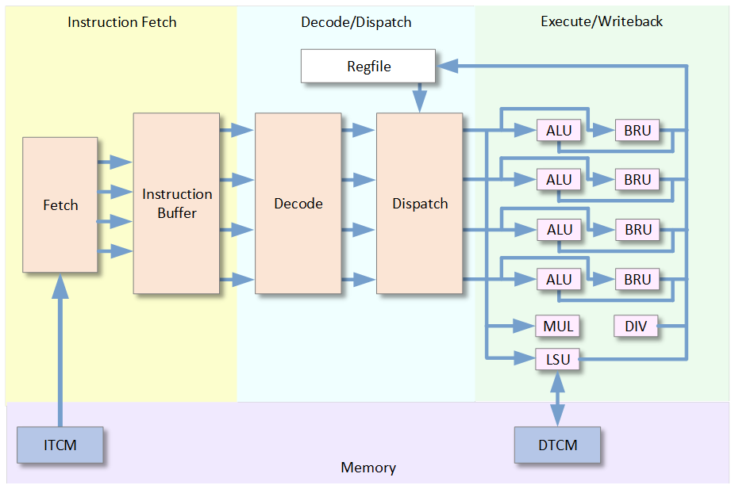

# CoralNPU Microarchitecture

## Pipeline

The CoralNPU base processor is an in-order three-stage pipeline capable of
dispatching up to 4 instructions per cycle. The instruction stages are:

* **Instruction fetch:** Instructions are fetched from memory into an
instruction buffer.
* **Decode/Dispatch:** The first 4 instructions in the instruction buffer are
decoded. Interlock and scoreboard logic determine which of the instructions can
be dispatched this cycle. Instructions are forwarded to their respective
execution units.
* **Execute/Writeback:** Execution units with dispatched instructions read
operands from the register file and perform computation. Results can also be
written back to the register file in the same cycle.

Some execution units can take multiple cycles to execute. Instruction latencies
can be found in the table below:

| Instruction Type | Latency (cycles) | Description            |
| ---------------- | ---------------- | ---------------------- |
| Alu              | 1                | Add, sub, xor, ...     |
| Csr              | 1                | CSR instructions       |
| Bru              | 1                | bge, jal, ebreak, ...  |
| Mlu              | 2                | mul, mulh, ...         |
| Dvu              | Variable         | div, rem, ...          |
| Lsu              | 2+               | lw, sw, ...            |
