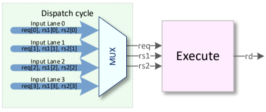
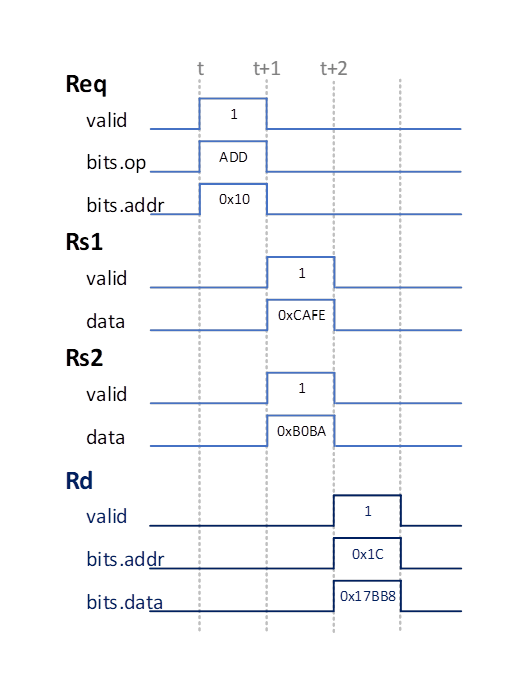

# Multiplication Unit

The Multiply Unit (MLU) executes multiplication operations: MUL, MULH, MULHSU
and MULHU.

## Interfaces

Inputs to the MLU are instructions from the Dispatch Unit or data reads from the
Register File. The single MLU in the CoralNPU core can service instructions from
any of the four instruction lanes, but only one command is dispatched in any
cycle.

Outputs of the MLU are writes to the Register file.

Figure 1 shows the inputs and outputs to and from the MLU.

Figure 1: Mlu interfaces

### MLU Inputs

Note: There are 4 instances of each of these signals (one for each instruction
lane).

| Signal Name  | Type          | Description                                                        |
| ------------ | ------------- | ------------------------------------------------------------------ |
| req.valid    | Bool          | If the command if valid.                                           |
| req.op       |               | The function to execute.                                           |
| req.addr     | UInt(5)       | The RegFile address to write the result to.                        |
| req.ready    | Bool (output) | If the command is accepted. Used in a ready-valid hand-shake.      |
| rs1.valid    | Bool          | If there is a valid rs1 read this cycle. Only used for assertions. |
| rs1.data     | UInt(32)      | The rs1 data read from the RegFile.                                |
| rs2.valid    | Bool          | If there is a valid rs1 read this cycle. Only used for assertions. |
| rs2.data     | UInt(32)      | The rs2 data read from the RegFile.                                |

### MLU Outputs

| Signal Name | Type     | Description                                                                       |
| ----------- | -------- | --------------------------------------------------------------------------------- |
| rd.valid    | Bool     | If the command if valid.                                                          |
| rd.addr     | UInt(5)  | The RegFile address to write the result to.                                       |
| rd.data     | UInt(32) | The computation result to write to RegFile.                                       |
| rd.ready    | Bool     | If the write result is accepted by the RegFile. Used in a ready-valid hand-shake. |

### Timing/Pipeline

The MLU is a three stage pipeline, with the following stages:

1. **Dispatch:** The dispatch unit determines if MLU operations can be executed.
Amongst the four lanes, the MLU accepts the first valid MLU instruction. This
request will be processed next cycle.
2. **Compute:** The second stage performs computation of the multiplication,
using the register read data from rs1 and rs2.
2. **Writeback:** The multiplication result is stored back to the register file.

A waveform showing a typical interaction with the waveform can be found in
Figure 2:

Figure 2: Mlu waveform.
